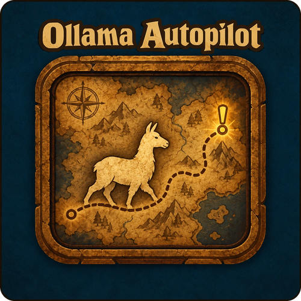

<div align="center">


<br>

[](https://github.com/liyunfan1223/azerothcore-wotlk)
[](https://www.azerothcore.org/)
[](https://github.com/liyunfan1223/mod-playerbots)
[](#using-other-llm-providers)
[](addon/OllamaMonitor/)
[](#license)

### An [AzerothCore](https://www.azerothcore.org/) + [Playerbots](https://github.com/liyunfan1223/mod-playerbots) module for WotLK 3.3.5a

**Bots that talk, remember and play.** In-character chat from a local or hosted language model,
and an experimental autopilot that lets the model run a bot the way a player runs a character.

[Overview](#overview) · [Features](#features) · [Autopilot](#autopilot) · [Monitor addon](#the-ollama-monitor-addon) · [Commands](#commands) · [Install](#installation) · [Configuration](#configuration) · [How it works](#how-it-works) · [Uninstall](#uninstall)

<br>

I build these as free, open source AzerothCore modules, and they stay free. If this one is
useful to you, you can support the work:

[](https://buymeacoffee.com/dustinhendrickson)

</div>

---

> [!CAUTION]
> **Language models do not understand anything.** They predict likely text from patterns in
> their training data. How good the bots sound depends entirely on the model you run, its
> training and your settings, and some replies will be off, odd or plain wrong. Use it with
> realistic expectations.
>
> - **It can load your server.** A local model needs real hardware, and every reply is a request.
> - **Autopilot is experimental** and off by default. Try it on a few bots first.
> - **Back up your characters database** before the first start. The module adds its own tables.

---

## Overview

mod-ollama-chat connects Playerbots to a language model through the Ollama API (or an OpenAI- or
Claude-compatible service). It does two things, and you can use either on its own:

|                    | **Chat**                                                           | **Autopilot** (experimental)                                         |
| ------------------ | ------------------------------------------------------------------ | -------------------------------------------------------------------- |
| What it does       | Bots answer players and each other in character                    | The model runs selected bots: who they are, what they want, what next |
| Who decides        | The model writes each line; code picks who answers and paces it    | The model gives the orders; code reports facts and carries them out  |
| What it knows      | Who is talking, where, the bot's personality, memories and mood    | The bot's quests, gear, money, surroundings, group, history          |
| Together           | Chat knows the bot's plans, and players can ask it to do things    | Requests from chat reach the planner, which decides what to do       |
| Switch             | `OllamaChat.Enable`                                                | `OllamaChat.Autopilot.Enable`                                        |

> [!IMPORTANT]
> To stop Playerbots' own chatter from talking over this module, set in `playerbots.conf`:
> `AiPlayerbot.EnableBroadcasts = 0`, `AiPlayerbot.RandomBotTalk = 0`,
> `AiPlayerbot.RandomBotEmote = 0`, `AiPlayerbot.RandomBotSuggestDungeons = 0`,
> `AiPlayerbot.EnableGreet = 0`, `AiPlayerbot.GuildFeedback = 0` and
> `AiPlayerbot.RandomBotSayWithoutMaster = 0`.

---

## Features

### Chat

- **Any model.** Ollama by default; `OllamaChat.Provider` also speaks the OpenAI Chat Completions
  format (OpenAI, OpenRouter, Groq, Mistral, DeepSeek, xAI, Gemini, LM Studio, vLLM, llama.cpp) and
  the Anthropic Messages API (Claude). See [Using other LLM providers](#using-other-llm-providers).
- **Context-aware replies.** Every prompt carries who is talking: class, race, role, faction, guild,
  level, zone, group, gold and what is around them, plus a WoW lore sheet so replies use the right
  names and terms from Vanilla through Wrath.
- **Personalities.** Each bot can get a personality (Gamer, Roleplayer, Trickster, ...) that shapes
  how it talks. Packs can be added and reloaded live; see [Personality packs](#personality-packs).
- **Random and event chatter.** Bots start conversations when a real player is near, and comment on
  what happens: quests done, rare loot, deaths, PvP kills, level-ups, duels, new spells,
  achievements.
- **Party-only mode.** Optionally, bots answer real players only inside the same non-raid party.
- **Command blacklist.** Lines that start with a Playerbots command are never answered.
- **Never on the game thread.** Replies are generated on worker threads and delivered on the world
  tick, so a slow model never stalls the server.
- **Live reload.** `.ollama reload` (or `ollama reload` on the console) reloads the config and
  personality packs without a restart.

### Conversation control

Bot chat can run away in several different ways, so there are four independent brakes. All are
configurable under the `CONVERSATION GOVERNOR` section of the config.

| Brake | What it stops |
|---|---|
| **Chain depth + decay** | A bot replying to a bot replying to a bot. Each hop also lowers the reply chance, so chains lose energy before the hard ceiling. |
| **The audience rule** | Bots holding conversations with nobody listening. Bots only reply to *other bots* while a real player has spoken in that channel recently. This does most of the work. |
| **Cooldowns and rate limits** | One bot, or one crowd, taking over a channel. Per bot, per channel and server-wide. The global limit also caps your LLM spend. |
| **Repetition scoring** | The same line twice, and the same *opening phrase* twice. Candidates are scored against the bot's own recent lines and the channel's recent traffic. |

If bots are looping, the setting to reach for first is
`OllamaChat.BotConversation.RequireRecentHuman`.

### What bots talk about

Topics are chosen from weighted categories rather than uniformly, and each bot avoids whatever it
used in its last few picks.

| Category | Default weight | Examples |
|---|---|---|
| **People** | 30 | Nearby players by name, class and what they are doing; group members; guildmates online; something the bot just watched happen |
| **World** | 30 | The nearest *interesting* creature (elite, rare, or a real threat, never a critter); named NPCs by role; landmarks; corpses; time of day |
| **Activity** | 25 | Current quest objectives; danger; group needs (someone low, someone out of mana) |
| **Self** | 15 | Spells, equipped items, bag space; the original topics, kept but demoted |

**Witnessed-event memory.** Bots keep a short memory of what they saw happen near them: kills,
deaths, level-ups, loot. That lets a bot comment on the fight you were both just in rather than
reciting a fact about itself.

`OllamaChat.Snapshot.IncludeSpells` defaults to **0**. Listing every off-cooldown spell a bot knew
put dozens of lines of the most quotable text in the prompt, which is why bots used to talk about
their spellbook so much.

### Memory and relationships

Conversation history is a sliding window: once a line falls out of it, the bot has no idea it
happened. Two mechanisms give bots continuity, both bounded so the prompt never grows without
limit however long a character has been alive.

- **Memory.** History builds up until it crosses a token budget. Then the model condenses it into a
  few short narrator-style notes, each scored 1-10 for importance, and the raw history is cleared.
  At prompt time the most important notes are picked within a smaller budget. A character slowly
  gathers what mattered and forgets the small talk.
- **Relationships.** When a name comes up often enough in a bot's history, the model writes (or
  revises) a sentence on how the bot feels about that person, and it goes into future prompts.
  Whoever the bot is talking to is always listed first.

Both work in normal and roleplay mode, and complement the numeric sentiment score: sentiment is how
warm the bot feels, these are *why*. Condensation and relationship writing are LLM calls too, run
on the dispatcher with a stricter queue allowance than replies, so upkeep never crowds out live
conversation. Requires `data/sql/characters/base/2026_08_29_memory_relationships.sql`; tune it
under `LONG-TERM MEMORY AND RELATIONSHIPS`.

| Setting | Default | Effect |
|---|---|---|
| `Memory.HistoryTokenLimit` | 1500 | How much history builds up before it is condensed |
| `Memory.PromptTokenBudget` | 400 | Hard stop on how much of the prompt memories may use |
| `Memory.MaxPerBot` | 40 | Notes kept per character; least important dropped first |
| `Relationship.MentionThreshold` | 8 | How often a name must come up before an opinion is written |
| `Relationship.MaxPerPrompt` | 3 | Relationships included per prompt |

### Roleplay mode

Off by default; turn it on with `OllamaChat.Roleplay.Enable`. Each race gets a speech register and
cultural touchstones, and each class a worldview: what that character *notices*. A Tauren speaks
slowly of the Earthmother; a Forsaken is dry and calls the living "breathers"; a priest sees wounds,
a hunter reads tracks, a rogue counts exits.

`OllamaChat.Roleplay.Strictness`:

- **0**: flavour only. Voices colour the prompt; nothing else changes.
- **1**: in character. Out-of-world words (`dps`, `nerf`, `patch`, ...) are rejected rather than
  spoken, and faction attitude applies.
- **2**: hard in character. In-world chatter lists replace the shipped ones, injuries and distances
  are described rather than quoted as numbers, and think mode is used where the model supports it.

`OllamaChat.Roleplay.CrossFactionGibberish` (on by default in roleplay mode) stops bots answering
across factions in say and yell; the client shows those as gibberish anyway. Race and class voices
can be overridden per server in the `mod_ollama_chat_voice` table without a rebuild.

### Body language

Replies come with movement, so they read as conversation rather than as a log line.

- **Facing.** The bot turns to whoever it is answering, just before the line lands (not while
  moving, casting, fighting, flying, on a transport or teleporting).
- **Gestures.** The model may end a reply with `[emote:wave]`, `[emote:nod]` and the like. The tag
  is stripped before the line is spoken; `*waves*` and a bare `/wave` are recognised too. Emotes go
  through the client's own code path, so players see the animation and the "Bot waves at You."
  text, with the right race and gender variant.
- **Emote reactions.** Bots react when a player emotes at them: mirroring (a wave gets a wave),
  countering (a flex gets a laugh) or answering in words. The first two cost no LLM call.

### Passer-by buffs

In the old world a stranger running past would often throw you a Power Word: Fortitude or a Mark of
the Wild. Bots do the same. Out of combat, a bot buffs friendly players near it (and other bots,
unless `OllamaChat.Buff.BuffBots` is 0) with the buffs its class knows, and sometimes waves. It
won't buff someone whose sentiment is below `OllamaChat.Buff.MinSentiment`.

Buffs come from each bot's own spellbook: only instant, long-lasting, single-target buffs for
allies (Fortitude, Divine Spirit, Shadow Protection, Arcane Intellect, Mark of the Wild, Thorns and
the paladin blessings). A paladin gives one blessing per person: Kings if it knows it, otherwise
Wisdom for mana users and Might for everyone else. Bots never overwrite a buff someone has, don't
stop to buff while mounted, low on mana, eating or casting, and only buff a PvP-flagged player if
they are flagged too. Settings live under `OllamaChat.Buff.*`.

### Personality packs

Personality packs are collections of templates that define how bots roleplay. Name a pack
`YYYY_MM_DD_personality_pack_NAME.sql` and put it in `data/sql/characters/updates/`; it is applied
automatically at startup, with no manual import. Share and find packs on the
[discussion board](https://github.com/DustinHendrickson/mod-ollama-chat/discussions). Personality
commands are in [`PERSONALITY_COMMANDS.md`](PERSONALITY_COMMANDS.md); sentiment tracking is
described in [`SENTIMENT_TRACKING_DOCUMENTATION.md`](SENTIMENT_TRACKING_DOCUMENTATION.md), and RAG
lore retrieval in [`RAG_DOCUMENTATION.md`](RAG_DOCUMENTATION.md).

### Think mode

`OllamaChat.ThinkMode` takes `auto` (default), `on` or `off`. Under `auto` the module asks Ollama
what the configured model can do and only sends `think` to a model that reports it. It then spends
reasoning only where it changes the answer: off for short chat lines, on for sentiment analysis and
strict roleplay replies.

If a request is ever rejected for asking to think, the module remembers, logs it once and retries
without it. `OllamaChat.ThinkMaxLatencyMs` backs think mode off for the session if it is too slow for
chat. `.ollama reload` re-probes after you swap models. With a non-Ollama provider nothing is
probed (that would be a billed request): `auto` never requests reasoning, and `on` requests it on
every call and backs off for the session if the provider rejects it.

---

## Autopilot

<div align="center">

</div>

> [!WARNING]
> Experimental and off by default. Try it on a few bots first.

Autopilot makes the LLM the **controller** of selected bots. It decides who each character is,
what it wants and what it does about it, then gives the orders a player would whisper to their own
bot:

```
nc +grind,-quest          quest 783 reward 2   goto trainer
goto zone Tanaris         talents spec arms    equip upgrade
goto profession mining    goto vendor          b vendor
goto Marshal McBride      open Silverleaf      group invite Bob
```

Playerbots' own overhead controllers (`new rpg`, the older `rpg` wanderer and the `travel` planner)
are switched off while a bot is on autopilot, so nothing else picks where it goes or what it sets
out to do. Playerbots' AI still fights, loots, gathers and casts.

### A bot's evening

```
[plan]   "off to Tanaris to see the desert" for 60m [goto zone Tanaris]
[order]  goto zone Tanaris -> on the way to Tanaris (another continent)
[travel] boarded The Maiden's Fancy
[travel] arrived in Kalimdor by The Maiden's Fancy
[travel] took a flight to Gadgetzan, Tanaris
[travel] landed at Gadgetzan, Tanaris
[errand] arrived in Tanaris
[plan]   "first, a proper bed" for 20m [goto inn]
```

Every line is in `.ollama autopilot history <bot>`.

### What the LLM decides

- **Identity.** On a bot's first plan the LLM writes who it is: its playstyle, its outlook
  (*in-character*, casual *player* or *metagamer*), and what it loves, what bores it and what tempts
  it. It can revise this later.
- **Goals.** Reach a level, raise a profession, earn gold, visit a zone, finish quests, run
  dungeons, or anything in its own words. Progress is measured from the bot, not taken on the
  LLM's word.
- **Orders.** Up to 8 per plan, run in order. Everything after a trip waits until the bot gets
  there ("goto vendor, b vendor" buys at the vendor); strategy changes, group orders and whispers
  apply at once. A new plan with a trip replaces orders still waiting.
- **A player's choices.** Which quests to pick up, which reward to take, which professions to learn,
  which talent spec to follow, what to buy and sell, who to group with.
- **When to look again.** Each plan says how long it holds. When a trip ends the LLM is asked again
  within a minute (`QuickReplanSeconds`), so the bot doesn't stand idle.

### What the LLM sees

- **The character:** level, gender, race, class, zone, gold, gear durability and free bag slots.
- **Quests:** its log with ids. A finished quest says who takes it and where, and lists its reward
  choices (kind, stats, usable or not). A quest that isn't for its class or race is marked.
- **Quests on offer:** the quests it could take right now from friendly quest givers within 1200
  yards (the core's own test: level, class, race, chain, not already done; grey ones left out),
  nearest giver first. The order list says questing beats grinding.
- **Training:** how many spells and ranks its class trainer has for it, and what they cost.
- **Professions and talents:** skill levels, free primary profession slots; from level 10, unspent
  points and the class's specs.
- **Surroundings:** the nearest services, zones for its level, and what is worth acting on nearby:
  bodies to loot or skin, herb and ore nodes (and whether it has the skill), chests, fishing pools,
  crafting stations, and what it could craft from its bags.
- **People:** players and bots of its faction nearby, its group with each member's quests, an invite
  waiting, recent whispers both ways, and requests players made of it in chat.
- **Feedback and history:** what each of its last orders did, its goal and progress, rewards in the
  last hour, recent events and temptations (a dungeon just unlocked, an epic drop).

The order list it is given is in `mod-ollama-chat_autopilot_commands.cpp`
(`OllamaChat.Autopilot.CommandReference` replaces it). The monitor addon's Planner tab shows the full
prompt.

### What autopilot controls

| Area | Orders | Where |
|---|---|---|
| Behaviours | `nc +x,-y` / `co +x,-y`: any Playerbots strategy except the overhead controllers (grind, quest, gather, loot, lfg, bg, pvp, flee, potions, aoe, ...) | Combat ones everywhere; the rest only while the bot is on its own |
| Quests | `quest <id>` goes to the objective and works it, nearest need first: creatures to kill (kill-credit ones too), objects to use, friendly NPCs to speak to, and the creatures and objects that hold quest items. Chests, crates and plants are opened the way the client does it, with the opening or gathering spell, and emptied. With nothing in sight it moves to where more are, then explores (four legs of about 120 yards), until done or `QuestHuntMinutes` (20) pass. Then it goes to whoever takes it in and turns it in, through the client's reward handler so quest scripts run; `quest <id> reward <n>` picks the reward. `abandon <id>` drops one | On its own |
| People | `goto <name>` walks up to an NPC and talks to them: finished quests are handed in and the quests they offer are taken. `goto <player>` walks to where that player stands | On its own |
| Errands | `goto repair / vendor / trainer / inn / flightmaster` goes there and uses it: repairs and sells junk, learns every affordable class spell, sets the inn as home, learns the flight point. `goto profession <name>` learns that profession, its next rank and recipes. `goto bank / auction / mailbox` goes there; `bank <item>` stores items, and a mailbox is emptied | On its own |
| Travel | `goto zone <name>`, anywhere in the world: walking, flight masters, boats, zeppelins and portals (the Dark Portal, city portals) as needed | On its own |
| Hunting | `goto hunt` goes to the nearest monsters of its level, or explores to find some (six legs, spiralling out). `nc +grind` fights what is around it | On its own |
| Groups | `whisper <name> <text>`, `group invite <name>`, `group accept`, `group decline`, `group leave`, `group share <quest id>`. Playerbots no longer invites, accepts or leaves groups for it. A bot that leads plans for everyone and waits for members who fall behind; members of a bot's group follow the leader and fight alongside. Leaving is allowed but discouraged unless its goals part ways (`OllamaChat.Autopilot.Groups`) | On its own |
| Talking about it | Chat knows what autopilot knows: replies, random chatter and event comments include what the bot is doing, its aim, where it is headed, its quests, its group and what is around it, as its own plans. Ask "what are you up to?" and it answers with the planner's picture | Always |
| Asking it to do things | Whisper it, or speak to it by name or in its group: "go pick that Silverleaf", "mine that vein", "open the crate", "come here", "invite me". The chat model answers and marks the request; the planner is asked again within seconds and turns it into orders. `OllamaChat.Autopilot.PlayerRequests`: `1` (default) the character decides and may decline; `2` it obeys accounts at or above `PlayerRequests.ObeySecurity`; `0` off. Denied orders stay denied | When asked |
| Upkeep and money | `talents spec <name>`, `equip upgrade`, `e` / `use <item>`, `open items`; at a vendor `s gray` / `s vendor` / `s <item>`, `b vendor`, `repair` | On its own |
| Auction house and mail | `ah look <item>`, `ah sell <item> [price each]`, `ah buy <item> [max price each]`, through the client's auction handlers (deposit and cut charged). Purchases and sales arrive by mail; `goto mailbox` collects them | On its own |
| Professions | `nc +gather` picks herbs and mines ore as it passes. `nc +loot` loots and skins. `nc +master fishing` fishes. `open <object>` walks to a node, chest or object and opens or uses it. `craft <recipe> [count\|all]` checks the tool and station, walks to a forge or fire if needed, and crafts from its own materials. `disenchant <item>` | On its own |
| Goals, identity, timing | Measurable aims, who the character is, how long a plan holds | Always |

### Earned, not handed out

With `OllamaChat.Autopilot.NoHandouts` (on by default) an enrolled bot has only what it earned, like
a player. For enrolled bots only, Playerbots' handouts are off:

- **Level-ups:** no free talents, trainer spells, consumables or gear, and no level-up teleport.
- **Re-rolls and refreshes:** none (they empty the bags, set the money and hand out supplies).
- **Dungeon finder:** autopilot accepts the group itself instead of Playerbots' refreshing accept.
- **Death:** no free repair on release and no sickness-free spirit healer. The bot runs back to its
  body; if it can't make it in time, it takes the spirit healer's resurrection like a player.
- **Flights:** no taxi cheat. It flies only between flight points it has discovered.
- **Orders:** `maintenance`, `autogear`, `bis` and a free `talents switch` are refused.

Enrolled random bots also stay logged in across restarts (`KeepOnline`), and are kept out of
Playerbots' level-bracket re-rolls (`AiPlayerbot.LevelBrackets.*`) by a `character_social` row owned
by guid 0 (no character), noted `ollama autopilot`, rebuilt at startup and removed when the bot
leaves autopilot.

Things the module can't change per bot:

- **Free eating and drinking:** Playerbots' global `AiPlayerbot.BotCheats` `food`. Remove `food`
  there if you want bots to buy their food.
- **Reset at max level:** `AiPlayerbot.ResetBotLevel.*` (off by default) ignores friend lists. If you
  turn it on, add enrolled bots to `AiPlayerbot.ResetBotLevel.ExcludeNames`.

### What it doesn't control

- **Fighting, targeting, casting and rotations.** Playerbots' AI does these. A bot attacked on the
  way fights back first, then carries on.
- **Orders on the deny list** (`Autopilot.DeniedCommands`): by default logout, resets, destroying
  items, teleports, summons, mail, cheats, debug, raw `do` actions, Playerbots' own `leave`,
  releasing the spirit, guild management and Playerbots' `rpg` commands.
- **Bots in a human's group.** The player leads; only combat, whisper and group orders are carried
  out. With `WithRealPlayer = 0` autopilot doesn't touch them at all.
- **Bots in a dungeon or battleground, or following a bot group's leader.** Only combat (and
  whisper and group) orders. Out-of-combat strategies go back to what the bot had before; when it
  leaves, the LLM's strategies return and it is asked what to do next.
- **Bots it can't plan for.** With nobody near (the default reach) a bot keeps its last orders.

### Getting around

Travel is autopilot's own; it doesn't use Playerbots' NewRpg.

- **Walking.** Anything further than 60 yards follows a route built on the server's navmesh, the
  way mod-city-siege routes its armies, along Playerbots' road network on long walks. A bot only
  ever moves along a real navmesh path: never through walls, never up a mountainside, but up
  stairs and spiral staircases, through doors and over bridges. It is handed one node (about 28
  yards) at a time, and the route is built a few hundred yards ahead. A stuck bot reroutes twice
  before the trip fails, and no single walk runs longer than half an hour.
- **Reaching people.** A walk up to an NPC is done only within touching distance, in three
  dimensions, so the foot of a tower is not "there".
- **Staying on the road.** While on a trip, `grind` doesn't pull monsters in reach or wander off.
  Whatever attacks the bot is fought, and grind picks up again on arrival.
- **Looting kills.** After a fight, the bot loots the bodies it may loot within 25 yards before it
  moves on, the way the client does. Quest items drop this way.
- **Casting on the way.** The walk waits while the bot casts (a pet summon, a buff) and stops for
  two seconds every thirty, because Playerbots never starts a spell with a cast time while moving.
- **Flights.** Taken when they clearly save distance and the bot can pay, between flight points it
  has discovered. Bots pick up flight points as they pass flight masters.
- **Boats and zeppelins.** Found at startup from the server's transports. A dock belonging to the
  other faction is never used; neutral ports such as Booty Bay are open to both. The bot waits at
  the dock, boards when the ship docks, stays on deck and steps off at the other end.
- **Portals.** The Dark Portal both ways, and city portals in Shattrath, Dalaran, the Silvermoon orb
  and the like. A portal belonging to the other faction is never used.
- **Another way.** If a crossing doesn't work, the bot tries another rather than giving up.

**No teleporting** (`NoTeleport`, on by default). Playerbots' periodic teleport is pushed back every
hour. A dead bot releases, walks its ghost back and reclaims its body; after `CorpseRunMinutes` (10)
it takes the spirit healer's resurrection. `NoRandomize` holds Playerbots' periodic re-roll. Both
holds are set at startup, before any bot logs in.

**Handing back.** Before autopilot changes anything, the bot's strategies are recorded. When it is
turned off, or autopilot is disabled, the bot goes back to exactly that.

### Quick start

1. Apply `data/sql/characters/base/2026_10_05_autopilot.sql` to your characters database (an
   earlier version of the tables is repaired at startup).
2. In `mod_ollama_chat.conf`:
   ```ini
   OllamaChat.Autopilot.Enable = 1
   OllamaChat.Autopilot.Select.RandomBotPercent = 5
   OllamaChat.Autopilot.Debug = 1                 # log every plan and order
   ```
3. Restart, or run `.ollama reload`. Stand near some bots: bots near real players are planned for
   first.
4. `.ollama autopilot status <bot>` shows a bot's identity, plan, goal and what each order did;
   `.ollama autopilot history <bot>` shows the diary. The [monitor addon](#the-ollama-monitor-addon)
   shows all of it live.

### Choosing which bots

| Setting | Selects |
|---|---|
| `Select.RandomBotPercent` | That share of random bots. The selection is stable, so raising it only adds bots |
| `Select.RealPlayerGuilds` | Every bot in a guild with a human member, online or not |
| `Select.Guilds` / `Select.Accounts` | Bots in the listed guild or account ids |
| `Select.Include` / `Select.Exclude` | Bots by name. Exclude always wins |
| `Select.AltBots` | Alt and addclass bots (off by default) |
| `Select.MinLevel` / `MaxLevel` | Level band for the rules above (1 to 80) |
| `MaxEnrolled` | Cap on rule-selected bots. Deleted characters free their place |
| `AllowMasterEnroll` | Lets a bot's master whisper `nc +autopilot` |

`.ollama autopilot on|off <bot>` (or the monitor's Turn on / Turn off) always overrides the rules.

### Controlling cost

A bot asks for a new plan when its last plan runs out, or when something happens: a level, a goal
done or stalled, an errand done or failed, an alert (deaths, broken gear, full bags, an empty quest
log with quests nearby, an invite), a player's request, or leaving a dungeon or group. How often it
may ask depends on its tier:

| Tier | When (defaults) | Asks at most every |
|---|---|---|
| foreground | a real player in the same zone, or a guildmate online | `DecisionIntervalMinutes` (15), or sooner if the model asked |
| background | a real player on the same map | `BackgroundIntervalMinutes` (30) |
| dormant | nobody around | not asked; keeps its last orders |

All plans share `LlmCallsPerHour` (300). To give the LLM to more bots:

| Profile | `ForegroundScope` | `BackgroundScope` | `MinimumTier` |
|---|---|---|---|
| Light (default) | `zone` | `map` | `dormant` |
| Busy realm | `map` | `world` | `dormant` |
| Everyone thinks | `world` | `always` | `background` |

Raise `LlmCallsPerHour` and `MaxConcurrentPlans` to match. `Autopilot.Model` can send planning to a
different model than chat.

**No real players online** (a selfbot, or an empty realm): set `OllamaChat.Autopilot.RequireRealPlayer
= 0` so every enrolled bot is planned for. Playerbots also idles bots with no real player near
(`AiPlayerbot.BotActiveAlone`, 10% by default); for every bot awake, set
`AiPlayerbot.BotActiveAlone = 100` and `AiPlayerbot.botActiveAloneSmartScale = 0` in
`playerbots.conf`, or the lighter `AiPlayerbot.BotActiveAloneForceWhenInMap = 1`. The monitor's
Overview shows each bot's "playerbots activity".

### Making it yours

- `Autopilot.DeniedCommands` lists orders the LLM may never give. `nc +pvp` denies one change; `nc`
  denies every out-of-combat strategy change.
- `Autopilot.CommandReference` replaces what the LLM is told it can order.
- `Autopilot.PromptTemplate` replaces the whole planning prompt.

Every option is documented in `mod_ollama_chat.conf.dist` under *AUTOPILOT*; design notes are in
[`docs/autopilot-plan.md`](docs/autopilot-plan.md).

### Good to know

- Boats and zeppelins depend on the server's transports running. A bot that waits at a dock for
  `Travel.BoatWaitMinutes` with nothing coming fails the trip, and the LLM is told. The startup log
  line "indexed N boat/zeppelin crossings ..." shows what was found.
- If the model turns a quest in without choosing a reward, autopilot takes the usable choice with
  the highest item level.
- Decisions are only as good as your model. A small model may give thin identities or orders that
  don't fit. Every refused or failed order is shown to the LLM on its next plan.

---

## The Ollama Monitor addon

`addon/OllamaMonitor` is a client addon for WoW 3.3.5a that shows what autopilot bots are doing,
live, without reading logs.

**Install:** copy `addon/OllamaMonitor` into your client's `Interface/AddOns`. Log in on an account
at `OllamaChat.Monitor.MinSecurity` (administrator by default), then type `/om` or click the
spyglass on the minimap (left-click shows or hides the window, right-click switches to log only,
drag to move it).

**The window:**

- **Title bar:** drag to move. The pill shows whether autopilot is on; when it is off, a red banner
  says why, and it also says when your account may not use the monitor or the server doesn't answer.
- **Left:** every online autopilot bot, with class icon, level, state (fighting, travelling,
  waiting on the model, idle, ...) and current task. Search by name, zone, state or task; the
  Fighting / Moving / Waiting / Idle filters show counts and narrow the list.
- **Bot card:** name, level, class, zone, task, state and tier, with the action buttons.
- **Pages**, refreshed automatically:
  - **Overview:** position, health, combat, movement, Playerbots' engine, activity and strategies,
    group, the model's identity, plan, goal, reason and last orders, and the watchdogs.
  - **Travel:** the errand, every leg of the trip, and the route builder's state.
  - **Planner:** the last prompt sent for this bot, and its raw reply or error.
  - **Chat:** personality, pacing, queued replies, recent replies and what became of them, history,
    the last chat prompt and reply.
  - **Mind:** memories, relationships, sentiment, recent topics and witnessed events.
  - **Events:** orders and results, decisions, requests and the diary.
- **Buttons:** **Follow camera** (your camera follows the bot, the way Mind Vision does; you are
  teleported along across maps, never into a dungeon), **Teleport to**, **Replan now**, **Status to
  chat**, and **Turn off / Turn on** (with nothing selected, Turn on uses your target). Every button
  goes through the monitor, so it needs only `Monitor.MinSecurity`.
- **Footer:** camera state, last update, **Auto refresh** and **Plain text** (no colours, so text
  copies cleanly with Ctrl+C), and a whisper box that talks to the bot through the normal chat.
- **Log only:** the button beside the close X shrinks the window to the bot's name and live log,
  see-through; drag the corner to resize. The mode and size are remembered.

---

## Commands

All `.ollama` commands need an administrator account (`SEC_ADMINISTRATOR`). On the console, drop the
leading dot.

### `.ollama`

| Command | Does |
|---|---|
| `.ollama reload` | Reloads the config, personality packs and sentiment data without a restart |
| `.ollama status` | Endpoint and model, think-mode support, queue depth and workers, delivered and dropped counts, why replies were suppressed, the last error. The first thing to run when bots go quiet |
| `.ollama test <prompt>` | Sends one prompt and logs the raw and cleaned output side by side, with the round-trip time |
| `.ollama sentiment view [bot] [player]` | Sentiment between bots and players |
| `.ollama sentiment set <bot> <player> <value>` | Sets it (0.0 to 1.0) |
| `.ollama sentiment reset [bot] [player]` | Resets it |
| `.ollama personality get <bot>` | A bot's personality |
| `.ollama personality set <bot> <personality>` | Assigns one |
| `.ollama personality list` | Every personality and its description |

### `.ollama autopilot`

| Command | Does |
|---|---|
| `.ollama autopilot status [bot]` | Overview (and why autopilot is off, if it is), or one bot's identity, plan, strategies, orders, goal and progress |
| `.ollama autopilot preview` | Dry-runs the selection rules: matches, tiers, LLM demand against the budget |
| `.ollama autopilot on\|off\|rules <bot>` | Force on, force off, or hand back to the rules |
| `.ollama autopilot history <bot> [n]` | The bot's diary: every plan, order, errand and event |
| `.ollama autopilot identity <bot> [clear]` | Show the identity, or have the LLM write a new one |
| `.ollama autopilot goal <bot> [kind target\|clear]` | Show or set a goal, e.g. `goal Bob reach_skill mining 150` |
| `.ollama autopilot replan <bot>` | Ask the LLM now |

### Addon

| Command | Does |
|---|---|
| `/om` | Opens or closes the monitor |
| `/om mini` | Switches between the full window and log only |
| `/om stop` | Releases the camera |
| `/om pause` / `/om resume` | Stops and restarts the auto refresh |

---

## Installation

### Requirements

- [liyunfan1223's AzerothCore](https://github.com/liyunfan1223/azerothcore-wotlk) with
  [mod-playerbots](https://github.com/liyunfan1223/mod-playerbots).
- [fmt](https://github.com/fmtlib/fmt). [nlohmann/json](https://github.com/nlohmann/json) and
  [cpp-httplib](https://github.com/yhirose/cpp-httplib) are bundled.
- An LLM: a local [Ollama](https://ollama.com) server, or a hosted provider.
- For HTTPS providers, an OpenSSL build (see [Using other LLM providers](#using-other-llm-providers)).

### Server

1. **Install fmt:**

   | Platform | Command |
   |---|---|
   | Windows (vcpkg) | `vcpkg install fmt` |
   | Ubuntu / Debian | `sudo apt install libfmt-dev` |
   | CentOS / RHEL / Fedora | `sudo dnf install fmt-devel` |
   | macOS | `brew install fmt` |
   | Arch | `sudo pacman -S fmt` |

2. **Clone the module:**
   ```bash
   cd /path/to/azerothcore/modules
   git clone https://github.com/DustinHendrickson/mod-ollama-chat.git
   ```
3. **Rebuild AzerothCore:**
   ```bash
   cd /path/to/azerothcore/build
   cmake .. && make -j$(nproc)
   ```
4. **Copy the config** and edit it to match your setup:
   ```bash
   cp modules/mod-ollama-chat/conf/mod_ollama_chat.conf.dist env/dist/etc/modules/mod_ollama_chat.conf
   ```
5. **Start the server.** The module's tables in `data/sql/characters/base/` are applied by the core's
   updater on start; the autopilot tables are also checked and repaired by the module.

### Setting up Ollama

1. **Install** from [ollama.com](https://ollama.com) (Windows and macOS installers; on Linux
   `curl -fsSL https://ollama.com/install.sh | sh`).
2. **Start it:** `ollama serve` (listens on `http://localhost:11434`).
3. **Pull a model** that fits your hardware, for example `ollama pull llama3.2:1b`. Browse
   [ollama.com/library](https://ollama.com/library).
4. **Check it:** `curl http://localhost:11434/api/tags` lists your models.
5. **Point the module at it** with `OllamaChat.Url` if it runs elsewhere.

To run Ollama on another machine, set `OLLAMA_HOST=0.0.0.0` before `ollama serve` and use that
machine's address in `OllamaChat.Url` (e.g. `http://192.168.1.100:11434`).

> [!WARNING]
> Exposing Ollama to a network can be a security risk. Allow port 11434 only from trusted machines.

### Using other LLM providers

Ollama is the default, but not required. Four settings in `mod_ollama_chat.conf` switch provider:

| Setting | Meaning |
|---|---|
| `OllamaChat.Provider` | `ollama` (default), `openai` or `anthropic` |
| `OllamaChat.Url` | The provider's full generation endpoint |
| `OllamaChat.Model` | The model name as the provider publishes it |
| `OllamaChat.ApiKey` | The API key; empty for local servers that need none |
| `OllamaChat.ApiKeyHeader` | Optional, for services with their own header name such as Azure OpenAI (`api-key`) |

`openai` is the **OpenAI Chat Completions format**, spoken by OpenAI, OpenRouter, Groq, Together,
Mistral, DeepSeek, xAI, Google Gemini (its OpenAI-compatible endpoint), LM Studio, vLLM, llama.cpp
server and Ollama's own `/v1/chat/completions`. `anthropic` is the native Claude Messages API;
Claude is also reachable through OpenRouter with `openai`.

<details>
<summary><b>Examples</b></summary>

```ini
# OpenAI
OllamaChat.Provider = openai
OllamaChat.Url      = https://api.openai.com/v1/chat/completions
OllamaChat.Model    = gpt-4o-mini
OllamaChat.ApiKey   = sk-...

# OpenRouter (one key, many vendors)
OllamaChat.Provider = openai
OllamaChat.Url      = https://openrouter.ai/api/v1/chat/completions
OllamaChat.Model    = openai/gpt-4o-mini
OllamaChat.ApiKey   = sk-or-...

# Anthropic (Claude)
OllamaChat.Provider = anthropic
OllamaChat.Url      = https://api.anthropic.com/v1/messages
OllamaChat.Model    = claude-haiku-4-5-20251001
OllamaChat.ApiKey   = sk-ant-...

# LM Studio (local, no key)
OllamaChat.Provider = openai
OllamaChat.Url      = http://localhost:1234/v1/chat/completions
OllamaChat.Model    = <the model id LM Studio shows in its server tab>
```

</details>

Then restart or run `.ollama reload`, check `.ollama status` (it shows the provider and whether a key
is set, never the key), and run `.ollama test hello`.

<details>
<summary><b>What to know</b></summary>

- **HTTPS needs an OpenSSL build.** CMake prints `[mod-ollama-chat] OpenSSL found - HTTPS support
  enabled`, and `.ollama status` shows `HTTPS: available`. Without it an `https://` URL is reported
  at startup and every request fails. On Windows install OpenSSL (`vcpkg install openssl`) and
  re-run CMake; on Linux install `libssl-dev` or `openssl-devel`.
- **Certificates are verified when a key is set.** Checks are skipped by default (so self-signed
  proxies in front of a local Ollama work) but turned on whenever `OllamaChat.ApiKey` is set.
  `OllamaChat.VerifyCertificates` overrides this.
- **API keys** go in `OllamaChat.ApiKey`: a bearer token for OpenAI format, `x-api-key` for
  Anthropic. A rejected key (HTTP 401/403) is logged once with what to check.
- **Cost and rate limits.** Chatter across many bots adds up on a metered API. HTTP 429 is retried
  a bounded number of times (`OllamaChat.RateLimitRetries`, honouring `Retry-After`, capped by
  `OllamaChat.RateLimitMaxWaitSeconds`). Start with `OllamaChat.EnableRandomChatter = 0` and a low
  `OllamaChat.MaxConcurrentQueries`, and watch the provider's usage page.
- **Settings that don't apply aren't sent.** `NumCtx`, `NumThreads`, `RepeatPenalty`, `MinP` and
  `TopK` have no OpenAI-format equivalent; Anthropic also has no `TopP`, `Seed` or penalties.
  `NumPredict` works everywhere (Anthropic needs a cap, so `0` becomes 1024).
- **Self-healing parameters.** Newer OpenAI models reject `max_tokens` for
  `max_completion_tokens`, and reasoning models reject sampling values. Both are detected from the
  first rejection, logged once and retried at once.
- **Keep the key private.** Treat the conf like `worldserver.conf`.

</details>

---

## Configuration

Every setting is documented, with its default, in
[`conf/mod_ollama_chat.conf.dist`](conf/mod_ollama_chat.conf.dist), which is the module's real
reference. Most changes apply with `.ollama reload`. Where to start:

| Section | Covers |
|---|---|
| Core | `OllamaChat.Enable`, provider, URL, model, key, worker threads, queue depth |
| Chat | Reply chances and distances, random and event chatter, party-only, blacklist, templates |
| Conversation governor | Chain depth, the audience rule, cooldowns, rate limits, repetition |
| Memory, roleplay, buffs, think mode | The features above |
| Autopilot | `OllamaChat.Autopilot.*`: selection, tiers and budget, handouts, travel, groups, player requests |
| Monitor | `OllamaChat.Monitor.Enable`, `OllamaChat.Monitor.MinSecurity` |

---

## How it works

1. **Filtering.** A chat line is checked for type, distance and the command blacklist (and party
   rules, if on).
2. **Who answers.** Eligible bots in range are gathered, reply chances applied, and the count capped
   (`MaxBotsToPick`). The governor's brakes apply here.
3. **The prompt.** Built on the world thread from templates and live context: both characters, the
   place, personality, history, memories, relationships, the bot's surroundings, and, for an
   autopilot bot, its plans.
4. **The request.** Sent to the model by a bounded worker pool; workers only do HTTP and string
   work. A slow model sheds load (`OllamaChat.MaxQueueDepth`) instead of building a backlog.
5. **Delivery.** On the world tick the reply is cleaned (think blocks, tags, markdown), spoken in the
   right channel, and acted out (facing, gesture). A bot's own say and yell, and guild-wide events,
   are queued to the world tick so nothing touches another map's objects.
6. **Autopilot**, alongside: a sweep visits a fixed number of bots each tick, reports facts to the
   planner when a plan is due, and carries out the orders that come back.

---

## Uninstall

<details>
<summary><b>Steps</b></summary>

With the worldserver stopped:

1. While the server is still running, set `OllamaChat.Autopilot.Enable = 0` and run
   `.ollama reload`: online autopilot bots get back the strategies they had before. Then stop the
   server.
2. Back up the characters database, and remove the level-bracket shield rows autopilot added:
   ```sql
   DELETE FROM character_social WHERE guid = 0 AND note = 'ollama autopilot';
   ```
3. Delete `modules/mod-ollama-chat` and `mod_ollama_chat.conf`, re-run CMake and rebuild.
4. Optionally drop the module's tables from the characters database:
   `mod_ollama_chat_personality`, `mod_ollama_chat_personality_templates`,
   `mod_ollama_chat_history`, `mod_ollama_chat_bot_player_sentiments`, `mod_ollama_chat_memories`,
   `mod_ollama_chat_relationships`, `mod_ollama_chat_voice`, `mod_ollama_chat_autopilot`,
   `mod_ollama_chat_autopilot_events` and `mod_ollama_chat_autopilot_snapshots`.
5. Remove `Interface/AddOns/OllamaMonitor` from clients that installed the addon.

</details>

---

## Contributing

Issues and pull requests are welcome. With a bug report, include your AzerothCore revision, the
module commit, your `mod_ollama_chat.conf` changes, the model and provider, and the worldserver log
around the failure (`module.ollamachat`). For autopilot, the monitor's Overview, Travel and Planner
pages show most of what is needed.

## License

GNU Affero General Public License v3. See [`LICENSE`](LICENSE).

## Credits

Developed by [Dustin Hendrickson](https://github.com/DustinHendrickson). Built on
[AzerothCore](https://www.azerothcore.org/) and [mod-playerbots](https://github.com/liyunfan1223/mod-playerbots).
Autopilot's navmesh routing is ported from mod-city-siege. Uses
[cpp-httplib](https://github.com/yhirose/cpp-httplib), [nlohmann/json](https://github.com/nlohmann/json)
and [fmt](https://github.com/fmtlib/fmt). This project is unaffiliated with Blizzard Entertainment.
